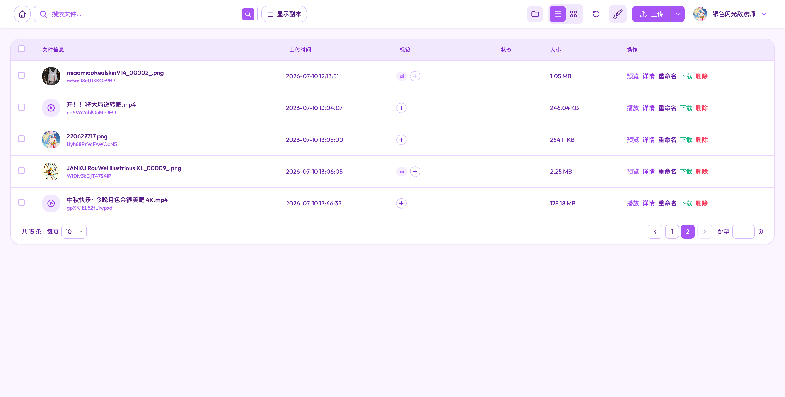
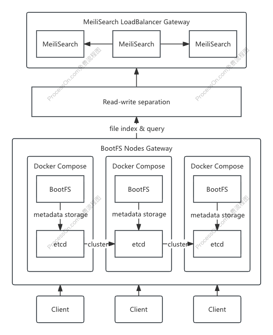

# BootFS

[English](./README-en.md)

<details>
  <summary>界面预览</summary>
  
  
</details>

一个轻量级 & 专注于多媒体文件的文件管理系统，基于 Spring Boot & FFmpeg。

## 你为什么需要 BootFS ？

答案可能在其中之一，我个人只是刚好满足其中的所有原因。

- 你受够了传统分布式文件系统的丑陋 UI，想有一个拥有更现代、交互更出色的界面的文件存储服务，最好还兼容 s3 协议
- 你是一个赛博仓鼠，热衷于收集各种互联网资源，比如图片、视频、音频、模型等，并且喜欢一个人在电脑前欣赏这些艺术
- 你看完了凉宫春日的忧郁，忽然想构建一个站点来无限循环播放漫无止尽的八月
- 你是一个 AIGC 信徒，常年混迹于各种 AI 创作平台，当你不断的精进自己的用提示词摇奖的能力时，你望着自己一大堆 output 陷入了沉思
- 你想试试一款更现代的图床，比如基于 BootFS 的图床，或者基于 BootFS 的视频床
- 出于某种原因，你不想使用公有云大厂提供的网盘，你想要一个自托管的网盘
- 你需要找到一个更全面的数字资产管理软件

## 架构



采用去中心化对等边缘存储架构 (Decentralized Peer-to-Peer Edge Storage Architecture)

## 特性

- 优秀的列表 / 网格模式下的音视频预览能力，支持多种格式的详情/文件描述预览
- 经典的双栏布局，更好的挑选将某个本地路径下的图片文件并上传
- 基于 tag 的分类管理，方便用户组织自己的资源
- 图片支持 ComfyUI 格式的关键元数据，比如 prompt、cfg、sample、steps 等
- 基于 Tailwind CSS 精心设计 UI/UX 的资源管理界面，优秀的预览能力
- 内置了一个 hls 流个人放送平台，并且可以碎片化的上传 hls 流文件，在线上与朋友共同欣赏大片
- 内置了一个酷炫的瀑布流随机画廊
- 通过 FFmpeg 实现了 webp 编解码以及 hls 转码能力
- 基于 etcd + meilisearch 小而精的轻量化架构，内置元数据管理，基于对等节点设计的可分布式结构

Build with ：spring-boot + etcd + meilisearch

## 部署

HostID 是一个基于电子邮件实现的轻量级账户底座，可以作为个人邮箱的同时，管理小规模的站点如个人博客，小型论坛等。

默认开启基于 hostid 的 sso 鉴权，无需额外配置，如需关闭请查阅 application.properties & Dockerfile 并配置 .env

**前置(recommend):** **[Hostid](https://github.com/ginpika/hostid)**

```shell
# 找个地方
mkdir bootfs
# 获取 compose.yaml
wget -O compose.yaml https://raw.githubusercontent.com/ginpika/bootfs/refs/heads/main/docker-compose.ghcr.yml
# 根据 application.properties & Dockerfile 编写 .env
cp .env.example .env
# 一键启动
docker compose up -d
```

## 集群部署

见 [cluster-deploy.md](./docs/cluster-deploy.md)
